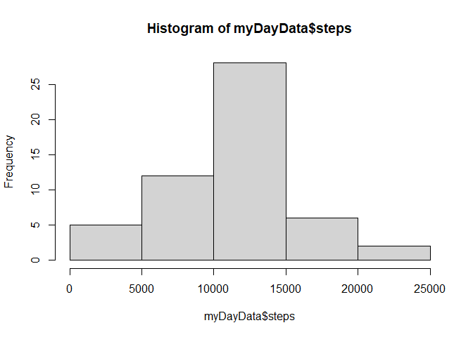
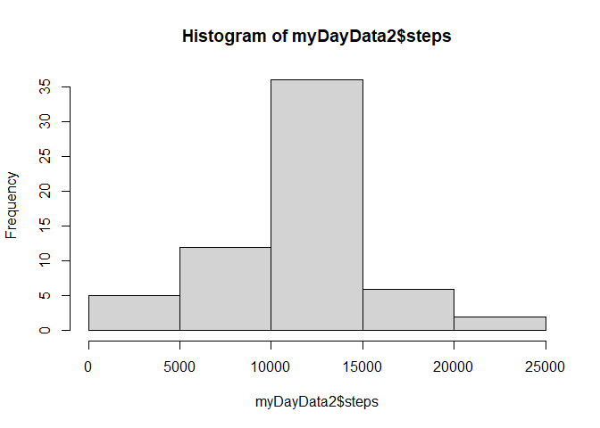
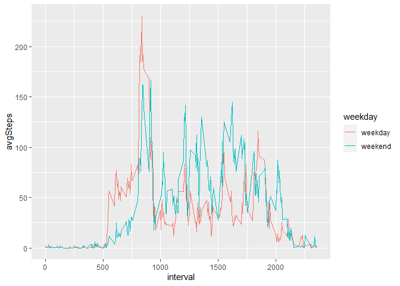

Reproducible Research - Peer Assignment 1
=========================================

This document will show the steps of the assignment for week #2.

First action is to read the activity.CSV file in **myData** variable. The file must be present in the working directory. If the file is not there, please unzip the file and place it in the working directory manually.


```r
myData <- read.csv("activity.csv")
```

Change the data types to be able to handle numbers and dates.


```r
myData$steps <- as.numeric(myData$steps)
myData$date <- as.Date(myData$date)
myData$interval <- as.numeric(myData$interval)
```

The new dataframe **myCleanData** removes the rows where steps is NA.


```r
myCleanData <- myData[!is.na(myData$steps),]
```

The dataframe **myDayData** sums up all steps by day, not taking into account NA values. Also, the names of the dataframe are set for simplicity and readability.


```r
myDayData <- aggregate(myCleanData$steps, by=list(myCleanData$date), sum)

names(myDayData) <- c("date", "steps")
```

The histogram of the total number of steps taken each day is displayed below (requirement #2)


```r
hist(myDayData$steps)
```

<!-- -->

The mean is the sum of all steps dividing the total number of days which is 61. The mean function cannot be used straightforward in this case as not all days have data. The median is displayed using the standard function. (Requirement #3)


```r
sum(myDayData$steps) / 61
```

```
## [1] 9354.23
```

```r
median(myDayData$steps)
```

```
## [1] 10765
```

The dataframe **myIntervalData** calculates an average of steps for each interval, not taking into account NA values. Also, the names of the dataframe are set for simplicity and readability.


```r
myIntervalData <- aggregate(myCleanData$steps, by=list(myCleanData$interval), mean)

#Change names
names(myIntervalData) <- c("interval", "avgSteps")
```

Time series plot of the average number of steps taken is displyed below (requirement #4) using ggplot.


```r
library(ggplot2)
```

```
## Warning: package 'ggplot2' was built under R version 4.0.3
```

```r
#line plot
ggplot(data=myIntervalData, aes(x=interval, y=avgSteps)) + geom_line()
```

<!-- -->

In order to determine de 5-minute interval that, on average, contains the maximum number of steps, the **MyInterval** dataset is going to be used. It will be sorted out be steps on descending order so then the first row will proide the answer (requirement #5).


```r
tmpOrder <- myIntervalData[rev(order(myIntervalData$avgSteps)),]

tmpOrder[1,1]
```

```
## [1] 835
```

The strategy for imputing missing data is to replace NA values with the average value for that interval. The dataframe **myNewData** contains the original dataset but replaces NA with the average for its interval (requirement #6).


```r
myNewData <- myData
for(i in 1:nrow(myNewData)) {
  if (is.na(myNewData[i,1]))
  {
    #replace NA with AVG interval value
    myNewData[i,1] <- myIntervalData[myIntervalData$interval == myNewData[i,3],2]
  }
}
```

The histogram of the total number of steps taken each day after missing values are imputed with the new strategy, is very similar to the previous one (requirement #7).


```r
myDayData2 <- aggregate(myNewData$steps, by=list(myNewData$date), sum)

names(myDayData2) <- c("date", "steps")

hist(myDayData2$steps)
```

<!-- -->

Add weekdays and weekends info to  **myNewData** dataframe.


```r
myNewData$weekday <- "weekday"
for(i in 1:nrow(myNewData)) {
  dayOfWeek = weekdays(myNewData[i,2])

  if (dayOfWeek == "Saturday")
  {
    myNewData[i,4] <- "weekend"
  }
  
  if (dayOfWeek == "Sunday")
  {
    myNewData[i,4] <- "weekend"
  }
}
```

Get weekday and weekend data, calculate averages for each of them, and consolidate results on **allAVgs** dataframe.


```r
myWeekdayData <- myNewData[myNewData$weekday == "weekday",]
myWeekendData <- myNewData[myNewData$weekday == "weekend",]

myAvgWeekday <- aggregate(myWeekdayData$steps, by=list(myWeekdayData$interval), mean)
myAvgWeekday$weekday = "weekday"

myAvgWeekend <- aggregate(myWeekendData$steps, by=list(myWeekendData$interval), mean)
myAvgWeekend$weekday = "weekend"

allAvgs <- rbind(myAvgWeekday, myAvgWeekend)

#Change names
names(allAvgs) <- c("interval", "avgSteps", "weekday")
```
For the panel plot comparing the average number of steps taken per 5-minute interval across weekdays and weekends (requirement #8), a two line plot is used


```r
ggplot(data=allAvgs, aes(x=interval, y=avgSteps, group=weekday, color=weekday)) + geom_line()
```

<!-- -->
